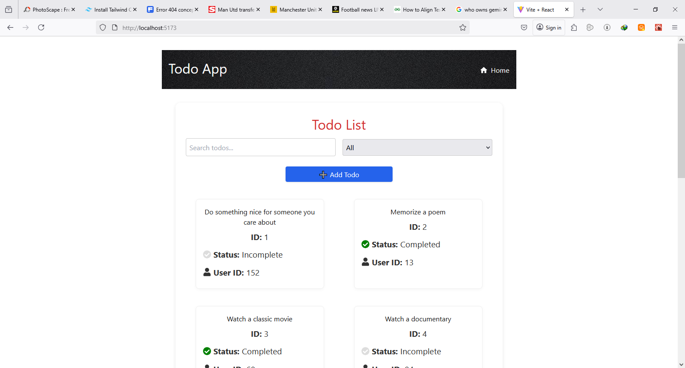
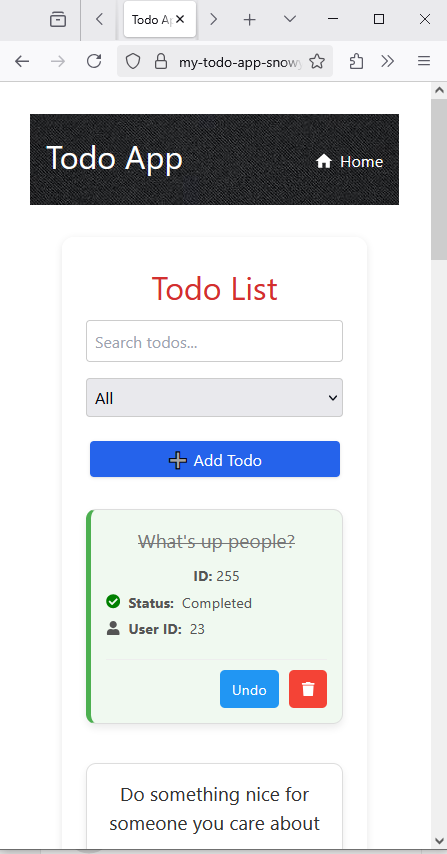
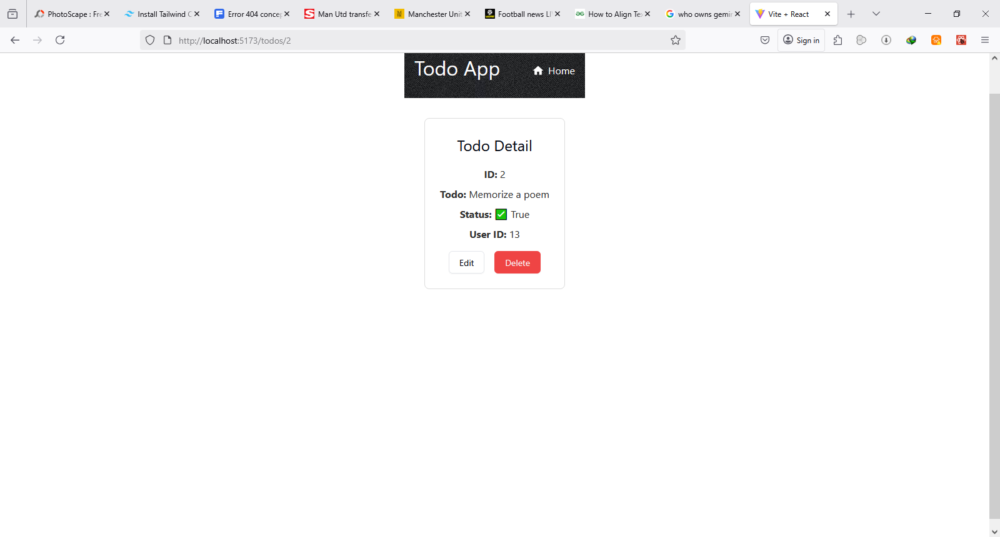
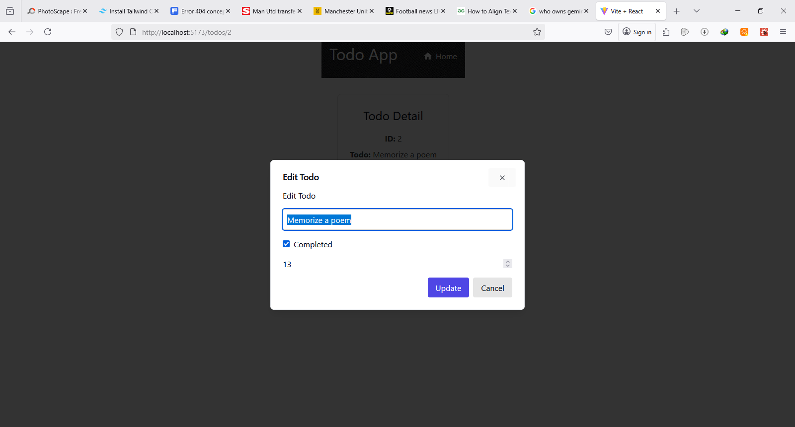
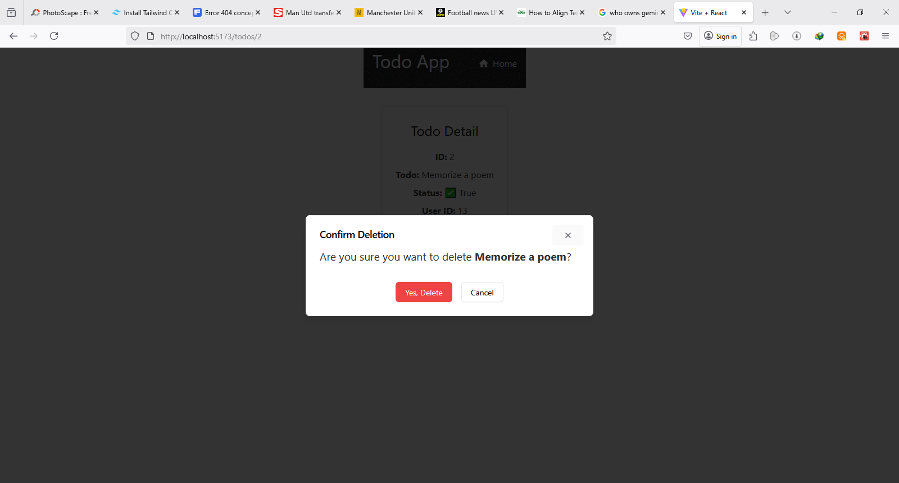

# 📝 React Todo List App

This is a fully functional, accessible, and responsive Todo List app built with:

- ✅ React + React Router v7
- ✅ TanStack Query (React Query)
- ✅ CSS Modules for styling
- ✅ Tailwind (via ShadCN UI for modals & buttons)
- ✅ DummyJSON API

---

## 📦 Features

- View list of todos with pagination
- Filter todos by status (completed or pending)
- Search todos by text
- View full details of each todo
- Add, edit, and delete todos using modal dialogs
- Accessible 404 page and error boundaries
- Keyboard-friendly navigation and focus styles
- Uses cache + fallback loading spinner

---

## Project Folder Review

my-todo-app/
├── public/ (favicons, index.html, etc.)
├── src/
│ ├── assets/ (404.png, screenshots)
│ ├── components/ (TodoItem, TodoForm, Spinner, UI dialog)
│ ├── hooks/ (useUpdateTodo, useDeleteTodo, etc.)
│ ├── lib/
│ │ ├── todoApi.js (fetch functions)
│ │ ├── cache.js (getCache, setCache utilities)
│ ├── pages/ (TodoList.jsx, TodoDetail.jsx, NotFound.jsx)
│ ├── styles/ (all .module.css files like TodoList.module.css)
│ ├── App.jsx  
│ ├── main.jsx (ReactDOM.createRoot / RouterProvider setup)
├── tailwind.config.js  
├── postcss.config.js  
├── package.json  
└── README.md (instructions, features, screenshots)

## 📸 Screenshots

### 📋 Todo List View



### 📋 Todo List Mobile View



### ➕ Add Todo Modal


### 📋 Todo List Details



### ✏️ Edit Todo



### ❌ Delete Todo

 <!-- Or your actual delete screenshot filename -->

### 🚫 404 Page


## 🚀 Getting Started

```bash
git clone https://github.com/your-username/my-todo-app.git
cd todo-app
npm install
npm run dev
```

## Build

npm run build
