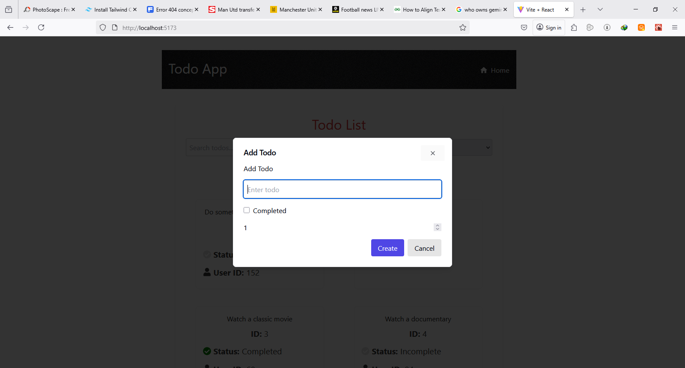

# 📝 React Todo List App

This is a fully functional, accessible, and responsive Todo List app built with:

- ✅ React + React Router v7
- ✅ TanStack Query (React Query)
- ✅ CSS Modules for styling
- ✅ Tailwind (via ShadCN UI for modals & buttons)
- ✅ DummyJSON API

---

## 📦 Features

- View list of todos with pagination
- Filter todos by status (completed or pending)
- Search todos by text
- View full details of each todo
- Add, edit, and delete todos using modal dialogs
- Accessible 404 page and error boundaries
- Keyboard-friendly navigation and focus styles
- Uses cache + fallback loading spinner

---

## Project Folder Review

my-todo-app/
├── public/ (favicons, index.html, etc.)
├── src/
│ ├── assets/ (404.png, screenshots)
│ ├── components/ (TodoItem, TodoForm, Spinner, UI dialog)
│ ├── hooks/ (useUpdateTodo, useDeleteTodo, etc.)
│ ├── lib/
│ │ ├── todoApi.js (fetch functions)
│ │ ├── cache.js (getCache, setCache utilities)
│ ├── pages/ (TodoList.jsx, TodoDetail.jsx, NotFound.jsx)
│ ├── styles/ (all .module.css files like TodoList.module.css)
│ ├── App.jsx  
│ ├── main.jsx (ReactDOM.createRoot / RouterProvider setup)
├── tailwind.config.js  
├── postcss.config.js  
├── package.json  
└── README.md (instructions, features, screenshots)

---

## 📸 Screenshots

### 📋 Todo List View


### 📋 Todo List Mobile View


### ➕ Add Todo Modal



### 📋 Todo List Details


### ✏️ Edit Todo


### ❌ Delete Todo


### 🚫 404 Page


---
## 🚀 Getting Started

```bash
git clone https://github.com/your-username/my-todo-app.git
cd todo-app
npm install
npm run dev
```
---

## Build

npm run build

---

## 🛠 API Integration

### 📡 API Used: [DummyJSON](https://dummyjson.com/)

The [DummyJSON](https://dummyjson.com/) API, a mock API for testing purposes, was used in this project for its data structure, support and persistent mutations for `POST`, `PUT`, and `DELETE` operations on todos.

### ✅ API Features Used

- `GET /todos` — to fetch the full list of todos  
- `GET /todos/:id` — to fetch a single todo by ID  
- `POST /todos/add` — to add a new todo  
- `PUT /todos/:id` — to update an existing todo  
- `DELETE /todos/:id` — to delete a todo

### 🧰 Usage Context

These endpoints are consumed using **TanStack Query (React Query)** for:
- Caching
- Background updates
- Mutation handling (add/edit/delete)

Custom hooks like `useUpdateTodo`, `useDeleteTodo`, and query keys like `["todos"]` or `["todo", id]` were created to manage this integration cleanly.

---

## 🧩 Challenges Faced During Development

### 1. Tailwind CSS Integration Issues
- Initially encountered failure while running `npx tailwindcss init -p`, and even after manually creating `tailwind.config.js` and `postcss.config.js`, styles like `bg-blue-500` did not apply.
- ✅ **Resolution**: A new React project was created with Tailwind installed cleanly. Tailwind was verified to work, but the team ultimately decided to use **CSS Modules** for layout styling and **ShadCN/UI** components selectively.

### 2. ShadCN/UI Integration Errors
- ShadCN buttons and dialogs failed due to missing the utility function `cn()` and unresolved alias `@/lib/utils`.
- ✅ **Resolution**: A `lib/utils.js` file was created containing the `cn()` helper using `clsx` and `tailwind-merge`. The alias was fixed in `vite.config.js` by configuring `@` to point to `src`.

### 3. Missing or Disappearing UI Elements
- The **Add Todo** button disappeared after adding filters and search due to an undefined state variable (`setShowAddModal`).
- ✅ **Resolution**: The missing state and modal logic were restored, and the button was moved to its own wrapper section for better layout and visibility.

### 4. Accessibility Alignment Issues
- The checkmark (✅) and cross (❌) icons in the Todo detail page were slightly misaligned with status text.
- ✅ **Resolution**: Various CSS alignment techniques were applied. Although not pixel-perfect on all platforms, alignment was acceptable and prioritized after functionality.

### 5. 404 Page Setup
- A fallback 404 page was required with an illustration and a way to guide the user back.
- ✅ **Resolution**: A `NotFound.jsx` page was created, using an image, a descriptive message, and a ShadCN-styled “Back to Home” button.

### 6. Pagination Bug
- An error occurred when `filteredTodos` became undefined during filtering, causing the app to crash.
- ✅ **Resolution**: Added safe fallback handling (`todos ?? []`) and validated state updates to ensure pagination worked alongside filters.

### 7. Styling Conflicts with CSS Modules and ShadCN
- Conflict emerged between Tailwind-based ShadCN styles and CSS Modules, especially when overriding spacing and layout.
- ✅ **Resolution**: Continued using **CSS Modules** for all layout and visual styling, while using ShadCN **only for interactive UI components** like `Button` and `Dialog`.

### 8. Centering the Add Todo Button
- The Add Todo button was initially aligned to the left due to the flex-direction column in the filter section.
- ✅ **Resolution**: Button was moved into a separate wrapper section styled with `justify-content: center`.

###

---